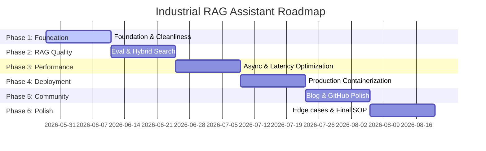

# 90-Day Execution Roadmap: Industrial RAG Assistant

This roadmap outlines the plan to transform our RAG prototype into a production-ready system by August 2026.

---

## 📅 Roadmap Overview

---

## 🛠️ Detailed Phase Breakdown

### Phase 1: Foundation & Honesty (Week 1-2) - *Completed / Current*
- [x] Comprehensive repository cleanup (strict `.gitignore`, remove caches, add MIT License).
- [x] Pin all direct and transitive dependencies exactly (`requirements.txt`, `requirements-dev.txt`, `pyproject.toml`).
- [x] Harden FastAPI security (CORS environments, service health checks, secure temporary file upload, exception shields).
- [x] Centralize logging using `logging.config.dictConfig` and thread-safe double-checked singleton initialization.
- [x] Establish high-coverage testing infrastructure (unit tests with mock decorators, integration tests with auto-skips).
- [x] Rewrite all documentation to reflect honest, unvarnished project status and baseline metrics.

### Phase 2: RAG Quality (Week 3-4)
- [ ] **Evaluation Dataset Expansion:** Expand baseline evaluation pairs from 25 to 50+ Q&As covering troubleshooting (40%), safety (25%), parts (20%), and schedules (15%).
- [ ] **RAGAS Telemetry Pipeline:** Build programmatic evaluator logging metrics (faithfulness, relevancy, recall, precision) to a local SQLite-backed MLflow service.
- [ ] **Hybrid Retrieval Setup:** Combine bi-encoder search with BM25 keyword search using Reciprocal Rank Fusion (RRF).
- [ ] **Cross-Encoder Reranker:** Integrate ms-marco reranking and benchmark bi-encoder vs. cross-encoder tradeoffs.
- [ ] **Deduplication Overhaul:** Replace page-based deduplication with text SHA-256 chunk-based comparison.

### Phase 3: Performance & Async (Week 5-6)
- [ ] **Async API Refactoring:** Migrate FastAPI endpoints to async handlers and introduce SSE (Server-Sent Events) for token streaming.
- [ ] **Connection Pooling & Cache:** Establish Qdrant connection pooling, LRU query caching, and query embedding caches.
- [ ] **Latency Profiling & Optimization:** Tune Qdrant HNSW parameters and implement quantized models or batch inference if needed.
- [ ] **Locust Load Testing:** Implement Locust performance scenarios targeting 100 concurrent users to verify p95 latency < 2.0s.
- [ ] **Prometheus Metrics:** Add Prometheus exporters and structured JSON logging.

### Phase 4: Production Deployment (Week 7-8)
- [ ] **Production Containerization:** Write multi-stage slim Dockerfiles and secure `docker-compose.prod.yml` setups with Nginx SSL reverse proxies.
- [ ] **Cloud Deployment:** Deploy to Fly.io or AWS ECS using robust task definitions.
- [ ] **API Security Hardening:** Add X-API-Key token authentication and rate-limiting using SlowAPI.
- [ ] **Uptime Monitoring:** Set up UptimeRobot status checks and configure a live status badge in README.

### Phase 5: Community & Blog (Week 9-10)
- [ ] **Technical Writing:** Publish a deep-dive technical engineering blog post (2k-3k words) on personal blog, Medium, and Dev.to.
- [ ] **GitHub Polish:** Add issue templates, pull request protocols, social preview assets, and pin to profiles.
- [ ] **Community Outreach:** Announce on Show HN, LlamaIndex Discord, and Qdrant developer channels.

### Phase 6: Final Sprint (Week 11-12)
- [ ] **Edge Cases:** Handle scanned PDFs (OCR engine), password protections, and Ollama connection losses gracefully.
- [ ] **Final SOP & CV:** Compile a metrics-heavy CV-focused `PROJECT_SUMMARY.md` and record a 2-minute Loom walkthrough video.
