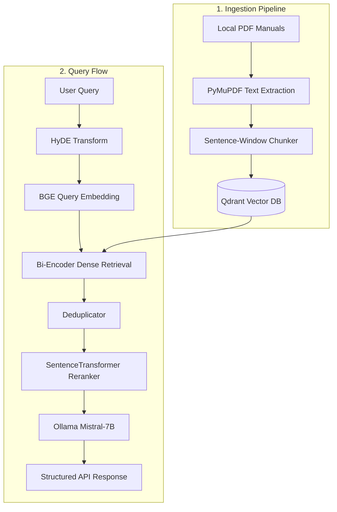

# System Architecture

This document describes the current architecture of the local prototype of the Industrial RAG Assistant.

---

## 🏗️ Architectural Overview

The diagram below maps out the request flow of the current prototype from document ingestion to user querying.

---

## 🧩 Component Descriptions

### 1. Ingestion Pipeline
- **PyMuPDF Parser:** Extracts raw text from loaded PDF files, preserving metadata such as page numbers and document filenames.
- **Sentence-Window Chunker:** Parses documents into individual sentences while preserving surrounding context windows (3 sentences before and after) to enrich generation quality. Falls back to a traditional token-based text splitter if the structure is invalid.
- **Qdrant Vector Store:** A local vector database fallback running in a local subfolder (`./qdrant_data`) when remote docker instances are unreachable.

### 2. Retrieval Engine
- **HyDE (Hypothetical Document Embeddings):** Uses the LLM to generate a hypothetical answer to the user query, which is embedded alongside the original query to bridge the vocabulary gap.
- **BGE Embedder:** Wraps the `BAAI/bge-small-en-v1.5` Hugging Face model locally with aggressive LRU caching to speed up query embedding generation.
- **Deduplication Postprocessor:** Filters near-duplicate text chunks based on Jaccard/text similarity algorithms.
- **SentenceTransformer Reranker:** Runs a local cross-encoder (`ms-marco-MiniLM-L-6-v2`) to compute high-accuracy relevance scores over the top-N retrieved nodes.

### 3. Generation & API Layer
- **FastAPI Application:** Hosts the `/health`, `/query`, and `/ingest` HTTP endpoints. Secured with strict CORS restrictions and structured exception shielding.
- **Ollama Client:** Interfaces with a locally hosted Ollama server executing the `mistral:7b-instruct` model.

---

## ⚠️ Known Limitations & Risks

1. **Local LLM Latency:** Running Mistral-7B on standard consumer CPUs can result in a p95 latency of over 4.5 seconds.
2. **Synchronous Handling:** API endpoints currently execute synchronously, which limits concurrency and throughput.
3. **Strict Page Deduplication:** Page-level deduplication inside some legacy postprocessors can lead to dropped relevant contexts if a single page holds multiple highly relevant, non-overlapping segments.
