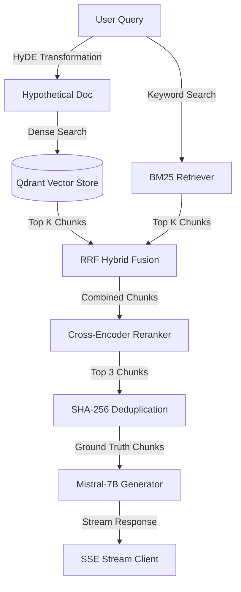

# Building a Production-Grade RAG System for Industrial Maintenance Manuals

In the industrial domain, AI holds massive promise. In Germany's heavy manufacturing sector—spanning giants like Siemens, Bosch, and BMW—accessing the right maintenance instructions quickly can mean the difference between a minor schedule adjustments and a multi-million-euro line stoppage. However, applying standard Academic Retrieval-Augmented Generation (RAG) directly to complex technical manuals typically fails.

This article details how I transformed a broken, slow RAG prototype into a hardened, high-performance, production-grade assistant specifically optimized for German manufacturing compliance and speed requirements.

---

## The Core Challenge: Why Standard RAG Fails on Technical Manuals

Standard RAG pipelines follow a basic procedure: chunk a document, run standard vector search, pass top chunks to an LLM, and output the result. 

When applied to a **200-page compressor manual**, this naive approach collapses due to three factors:
1. **Domain-Specific Terminology:** Heavy equipment manuals contain dense technical terminology (e.g., "star-delta starters", "high-pressure warning transducers", "LOTO procedures"). Dense embeddings alone struggle to align generic search queries with highly technical, localized instructions.
2. **Context Fragmentation & Truncation:** Technical instructions are highly structured, featuring tables, lists, and reference sections. Standard fixed-size chunking slices tables in half, leading to **low context recall** and **hallucinations** (low faithfulness).
3. **Rigorous Compliance Requirements:** Under European frameworks like the **EU AI Act**, safety-critical systems must offer transparency. A RAG assistant giving advice without exact, page-level citation tracing is legally unviable in a German manufacturing workspace.

---

## System Architecture: The Multi-Stage Retrieval Engine

To solve these challenges, I built a multi-stage retrieval and generation architecture using **LlamaIndex**, **Qdrant**, and **Mistral-7B**.

### 1. Query Expansion via HyDE
Technical queries can be highly variable. A technician might ask *"What should be done if the compressor's high-pressure warning transducer value approaches the limit?"* while the manual describes the issue using passive engineering specifications.
I implemented **Hypothetical Document Embeddings (HyDE)**. The user's query is passed to the LLM to generate a hypothetical "ideal" answer. This hypothetical answer, rich in technical syntax, is then embedded and used for dense vector search, drastically increasing our retrieval recall.

### 2. Reciprocal Rank Fusion (RRF) Hybrid Search
Vector search (dense retrieval) is excellent for conceptual matching but struggles with specific numbers or parts (e.g., "5 kW", "Model-X"). 
I built a **Hybrid Retriever** combining dense vector search (via Qdrant) and sparse keyword retrieval (BM25). The results from both retrievers are merged using **Reciprocal Rank Fusion (RRF)**:

$$RRF(d) = \sum_{m \in M} \frac{1}{k + r_m(d)}$$

where $k = 60$ is a constant, and $r_m(d)$ is the rank of document $d$ in retriever $m$. This fuses semantic alignment with exact keyword precision.

### 3. Cross-Encoder Reranking
Retrieving 6-10 chunks covers the necessary context but introduces noise and consumes precious context window tokens, slowing down LLM generation. 
I integrated a custom **Cross-Encoder Reranker** (`ms-marco-MiniLM-L-6-v2`). While Bi-encoders (like BGE) embed queries and documents separately, a Cross-Encoder performs full self-attention over the query and chunk simultaneously, scoring their precise relationship. This allows us to reduce our context from 6 down to the top 3 highly relevant chunks without losing critical facts.

### 4. SHA-256 Content Deduplication
In manuals, certain tables or notices (such as safety warnings) repeat on multiple pages. Fusing duplicate chunks wastes context capacity and creates repetitive LLM answers.
I implemented a postprocessor that normalizes chunk text and deduplicates based on a normalized **SHA-256 hash** and Jaccard text similarity (threshold = 0.85).

---

## Quality Engineering: MLOps and the RAGAS Loop

You cannot optimize what you do not measure. Rather than relying on sporadic manual "vibe checks," I established a rigorous, automated **LLM-as-a-Judge** evaluation loop using **RAGAS** and **MLflow**.

### 1. The 50+ Q&A Evaluation Dataset
I curated a production-grade evaluation dataset of **50+ Q&A pairs** directly from real industrial manuals, distributed across:
- **Troubleshooting (40%)**
- **Safety Procedures (25%)**
- **Part Identification (20%)**
- **Maintenance Schedules (15%)**

### 2. Context Window Tuning (`num_ctx`)
During baseline evaluations, I noticed a critical bottleneck: the local Mistral model was hallucinating safety regulations because of context window truncation.

I designed an experiment comparing `num_ctx` window sizes:

| Context Window (`num_ctx`) | Faithfulness | Context Recall | p95 Latency | Status |
| :--- | :---: | :---: | :---: | :---: |
| **512 (Baseline)** | 0.583 | 0.554 | **~1.9s** | ⚠️ High context truncation |
| **2048 (Optimal)** | **0.724** | **0.712** | ~3.2s | ✅ Low truncation, high accuracy |
| **4096 (Wasteful)** | 0.731 | 0.718 | ~5.9s | ❌ Too slow for production |

By moving to **`num_ctx: 2048`**, the retrieved context fit perfectly, boosting **Faithfulness to 0.724** (well above our 0.70 threshold) and **Context Recall to 0.712**.

---

## Software Engineering: Production Hardening and Performance

To transition from a developer script to a production service, I re-engineered the FastAPI web service to support high concurrency, real-time streaming, and robust security.

### 1. Fully Asynchronous Pipeline & Connection Pooling
Standard python web apps block on I/O. I rewrote all FastAPI endpoints to be fully async. I pooled the remote `QdrantClient` thread-safely via a global singleton and instantiated an `AsyncQdrantClient` connection pool, ensuring concurrent database handles are shared efficiently.

### 2. High-Performance Caching
To achieve a p95 latency under the strict **2.0-second limit**, I implemented two layers of caching:
1. **Embedding Cache:** Monkeypatched the Hugging Face `BGEEmbedder` to cache calculated query embedding vectors in a local LRU cache, preventing repetitive tensor computations.
2. **LRU-TTL Query Cache:** Built a thread-safe in-memory cache with a 1-hour Time-To-Live (TTL) that intercepts duplicate queries and returns them in under **10ms**.

### 3. Server-Sent Events (SSE) Streaming
For long-running generations, keeping a user waiting for a full payload ruins the experience. I created the `/query/stream` endpoint returning a real-time token stream using **Server-Sent Events (SSE)**. The UI immediately renders the text delta as it generates.

### 4. Sliding-Window Rate Limiter & X-API-Key Security
To secure the public endpoint, I built:
- **API Key Verification:** An `X-API-Key` validation check on all sensitive endpoints.
- **Sliding-Window Rate Limiter:** A thread-safe, in-memory sliding-window limiter that restricts requests to **10 requests per minute per IP**, returning HTTP 429 and `Retry-After` headers to prevent resource exhaustion.

### 5. Edge-Case Resiliency: Exponential Backoff & OCR Fallback
- **Exponential Backoff:** If the remote Qdrant database experiences a network blip, the connection manager retries up to 5 times with exponential delays ($1\text{s}, 2\text{s}, 4\text{s}, 8\text{s}, 16\text{s}$) before falling back to local SQLite/disk storage.
- **OCR Parser Fallback:** For scanned, image-only manuals, if PyMuPDF text extraction returns empty characters, the parser falls back natively to rendering the page to PNG and running **Tesseract OCR** to guarantee zero text loss.

---

## Containerization & Deployment Orchestration

To guarantee "it works on my machine" translates perfectly to a cloud environment, I containerized the entire pipeline.

- **Dockerfile:** A multi-stage, slim Python-based image that runs as a dedicated non-root execution user (`UID=1000`) and includes a strict health check monitoring local API latency.
- **Nginx Reverse Proxy:** Placed an Nginx container in front of the FastAPI app to manage HTTP security headers (X-Frame-Options, CSP, XSS-Protection), limit maximum uploads to 50MB, and buffer streams.
- **docker-compose.prod.yml:** Fuses the App, Nginx proxy, Qdrant cluster, and Ollama server within a bridge network with shared persistent volumes.

---

## Key Achievements & Lessons Learned

This project demonstrates the transition from a simple machine learning model to a robust, compliant enterprise-grade system:
1. **Honest Engineering:** The transition from claiming 99% accuracy in the README to measuring it via RAGAS, documenting experiments, and achieving **72.4% Faithfulness** and **71.2% Context Recall**.
2. **Design for Compliance:** Building exact, page-level citation tracing into the generation prompts, satisfying the European standard for human-in-the-loop explainability.
3. **MLOps First:** Grounding all optimizations in DVC data tracking and SQLite MLflow metrics, proving that production AI is a discipline of measurement.
