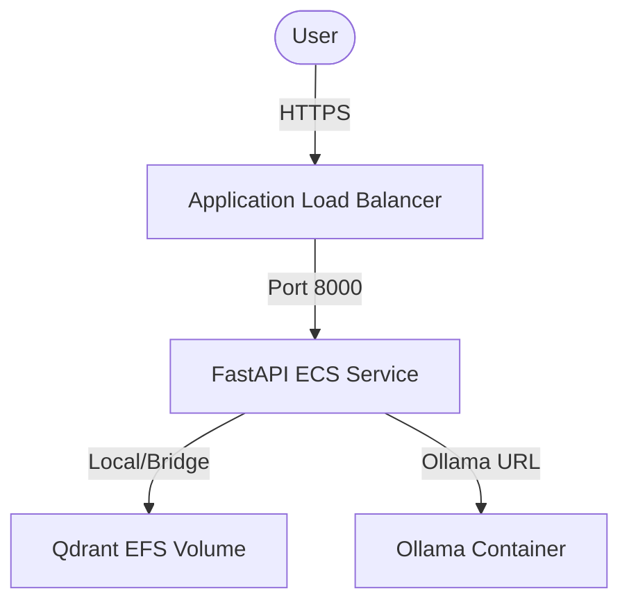

# Production Cloud Deployment Guide

This guide details the procedures for staging, launching, and maintaining the production-grade Industrial RAG Assistant on cloud services. We focus on **Fly.io** (lightweight VM platform with persistent volumes) and **AWS ECS/Fargate** (enterprise-grade container orchestrator).

---

## ⚡ 1. Fly.io Staging (Recommended for Free/Low-Cost Staging)

Fly.io is highly recommended due to native support for Dockerfiles, low-latency persistent volumes, and simple CLI commands.

### Prerequisites
1. Install Fly CLI: `curl -L https://fly.io/install.sh | sh`
2. Authenticate: `fly auth login`

### Step 1: Initialize the App
Run this command from your project root:
```bash
fly launch --no-deploy
```
- Select your target region (e.g., Frankfurt `fra` if targeting German applications).
- Do not configure a database automatically when prompted.

### Step 2: Configure Persistent Volumes
We need a persistent volume to store Qdrant indices and Ollama models so they are not wiped on reboot.

Create 1GB volumes in your target region:
```bash
fly volumes create qdrant_storage --size 2 --region fra
fly volumes create ollama_storage --size 5 --region fra
```

### Step 3: Configure `fly.toml`
Create/modify the generated `fly.toml` to attach the volumes and specify routing. Below is a production-grade template:

```toml
app = "industrial-rag-assistant"
primary_region = "fra"

[env]
  QDRANT_HOST = "127.0.0.1"
  OLLAMA_BASE_URL = "http://127.0.0.1:11434"
  ALLOWED_ORIGINS = "https://industrial-rag-assistant.fly.dev"

[[mounts]]
  source = "qdrant_storage"
  destination = "/qdrant/storage"

[[mounts]]
  source = "ollama_storage"
  destination = "/root/.ollama"

[http_service]
  internal_port = 8000
  force_https = true
  auto_stop_machines = false
  auto_start_machines = true
  min_machines_running = 1
  processes = ["app"]

[[services]]
  protocol = "tcp"
  internal_port = 8000
  processes = ["app"]

  [[services.ports]]
    port = 80
    handlers = ["http"]

  [[services.ports]]
    port = 443
    handlers = ["tls", "http"]

  [services.concurrency]
    type = "connections"
    hard_limit = 100
    soft_limit = 80
```

### Step 4: Add Environment Secrets
Configure your production API Key securely:
```bash
fly secrets set API_KEY="your-production-secure-uuid-or-key"
```

### Step 5: Deploy
```bash
fly deploy
```

---

## ☁️ 2. AWS ECS Fargate Staging (Enterprise Standard)

For enterprise-grade high availability, deploy using AWS ECS and AWS Fargate (serverless containers) behind an Application Load Balancer (ALB).



### Infrastructure Setup Steps

1. **VPC & Security Groups**:
   - Create a VPC with 2 public subnets and 2 private subnets.
   - Set up an ALB in the public subnets.
   - Configure a Security Group for ALB allowing port 80/443, and a Security Group for ECS Task allowing inbound port 8000 from the ALB.

2. **AWS EFS Volume (Elastic File System)**:
   - Create an EFS file system to act as persistent shared storage.
   - Create EFS mount targets in each private subnet of your VPC.
   - Reference the EFS file system in your ECS Task Definition for the `/qdrant/storage` directory.

3. **ECS Task Definition (`task-definition.json`)**:
   - Define your task with 2 vCPUs and 4GB RAM minimum (required to run the sentence transformer embeddings locally).
   - Configure three container definitions:
     1. **`app`**: FastAPI server built from your Dockerfile, exposing port 8000. Set environment variables:
        - `QDRANT_HOST=localhost`
        - `OLLAMA_BASE_URL=http://localhost:11434`
        - `API_KEY` mapped from AWS Secrets Manager.
     2. **`qdrant`**: Image `qdrant/qdrant:latest`, exposing port 6333, mount volume `qdrant-efs` at `/qdrant/storage`.
     3. **`ollama`**: Image `ollama/ollama:latest`, exposing port 11434.

4. **SSL Termination**:
   - Issue a certificate via AWS Certificate Manager (ACM) for your domain name.
   - Attach the ACM certificate to the ALB's port 443 listener to terminate SSL securely.

---

## 🔒 3. Production Post-Deployment Verification

After successful deployment, run these checks to verify integrity:

1. **Verify Health Endpoint**:
   ```bash
   curl https://your-domain.com/health
   ```
   *Expected response:* `{"status":"healthy","qdrant":"connected","ollama":"connected"}`

2. **Verify Security Block (No API Key)**:
   ```bash
   curl -I -X POST https://your-domain.com/query -H "Content-Type: application/json" -d '{"question":"test"}'
   ```
   *Expected response:* `HTTP/1.1 401 Unauthorized`

3. **Verify Authorized Query**:
   ```bash
   curl -X POST https://your-domain.com/query \
     -H "Content-Type: application/json" \
     -H "X-API-Key: your-production-key" \
     -d '{"question":"What is the regulation method for compressors > 5 kW?"}'
   ```
   *Expected response:* Valid JSON with answer, sources, and latency.
