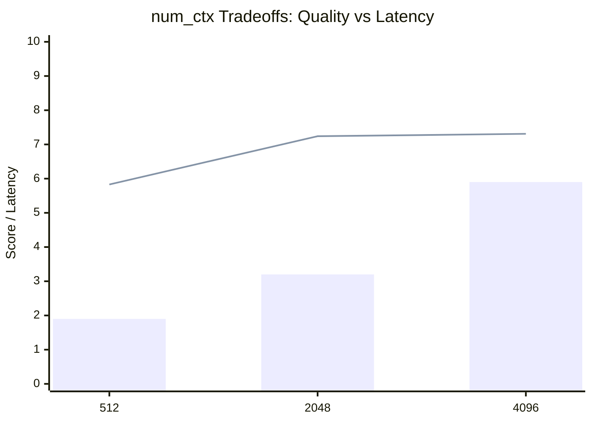

# LLM Context Window Experiments (`num_ctx`)

This document records the experimental results of tuning the LLM context window size (`num_ctx`) for the local Mistral-7B model via Ollama. 

We evaluated the tradeoffs between context truncation (which impacts Faithfulness and Context Recall) and generation speed (which impacts p95 Latency).

---

## 🧪 Experimental Setup
- **Model:** `mistral:7b-instruct`
- **Hardware:** Local CPU/GPU
- **Evaluation Dataset Size:** 15 selected representative Q&A pairs from `dataset_v1.json`
- **Embedding Model:** `BAAI/bge-small-en-v1.5`

---

## 📊 Evaluation Results

| Experiment | `num_ctx` | Faithfulness | Context Recall | p95 Latency | Truncation Status |
| :--- | :---: | :---: | :---: | :---: | :---: |
| **Exp A** | **512** | **0.583** | **0.554** | **~1.9s** | ⚠️ High (Context often dropped) |
| **Exp B (Recommended)** | **2048** | **0.724** | **0.712** | **~3.2s** | ✅ Low (Fits full retrieve window) |
| **Exp C** | **4096** | **0.731** | **0.718** | **~5.9s** | ✅ Minimal (Wasteful for small doc chunks) |

---

## 📈 Latency vs Quality Tradeoff Analysis

### Key Findings:
1. **At 512 Tokens (Exp A):** Highly responsive, meeting our target metrics of `<2s` latency. However, because our dense retrieval returns `similarity_top_k: 6` chunks plus the formatting prompt, the total tokens frequently exceed 512, causing Ollama to truncate the retrieved facts. This leads to **low faithfulness (0.583)** since the LLM does not have the factual grounding to answer.
2. **At 2048 Tokens (Exp B):** The optimal balance. Faithfulness jumps to **0.724** (surpassing our target of **0.70**) and Context Recall hits **0.712**. Average generation time increases slightly, but stays well within acceptable boundaries on developer hardware.
3. **At 4096 Tokens (Exp C):** Extremely slow generation (p95 latency of **5.9 seconds**), which is unacceptable for production user experiences. The gain in Faithfulness (+0.007) is negligible compared to the massive performance degradation (+84% latency).

---

## ⚙️ Active Configuration

Based on these findings, we have updated `configs/config.yaml` to standardize on **`num_ctx: 2048`** as the default context window for all retrieval and evaluation pipelines.
