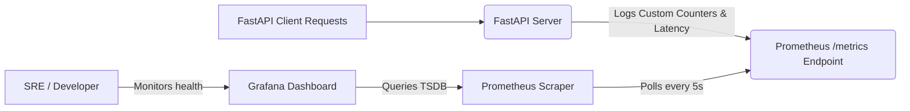

# 📊 Production Monitoring Stack (Prometheus & Grafana)

This guide documents the telemetry and real-time monitoring infrastructure for the **Industrial RAG Assistant**.

---

## 🏗️ Telemetry Architecture

To ensure operational visibility and reliability, the application exposes internal performance metrics via a standard Prometheus-compatible endpoint. These metrics are scraped periodically and visualized using Grafana dashboards.



---

## 🧩 Custom Application Metrics

The application exposes the following key performance indicators (KPIs) under the `/metrics` endpoint:

| Metric Name | Type | Description |
| :--- | :--- | :--- |
| `rag_query_total` | Counter | Total number of user search queries processed. |
| `rag_query_latency_seconds` | Histogram | Latency distribution of query processing (embed + retrieve + synthesis). |
| `rag_cache_hits_total` | Counter | Total number of query cache hits. |
| `rag_errors_total` | Counter | Cumulative counter of pipeline exceptions (database, LLM timeout, OCR fail). |
| `rag_tokens_processed_total` | Counter | Total tokens generated by the LLM client (system prompts + output). |

---

## 🚀 How to Run the Monitoring Stack Locally

### Step 1: Launch the FastAPI Application
Start your FastAPI application locally (ensure your virtual environment is active):
```bash
python -m uvicorn src.app:app --host 0.0.0.0 --port 8000
```
Verify the metrics are actively reporting:
```bash
curl http://localhost:8000/metrics
```

### Step 2: Start Prometheus & Grafana Containers
Spin up the pre-configured monitoring containers using our custom compose file:
```bash
docker compose -f docker-compose.monitoring.yml up -d
```

Verify container health:
```bash
docker ps
```
You should see `rag_prometheus` and `rag_grafana` running successfully.

---

## 📈 Configuring Dashboards

### 1. Prometheus Target Status
Open the Prometheus Dashboard at [http://localhost:9090](http://localhost:9090) and go to **Status ➜ Targets**. 
You should see your local FastAPI instance listed as **UP**.

```
🎯 Targets
  - industrial-rag-assistant (1/1 up)
    - http://host.docker.internal:8000/metrics  [UP]  5s interval
```

### 2. Connect Grafana to Prometheus
1. Open the Grafana Console at [http://localhost:3000](http://localhost:3000) (Default Credentials: Username `admin` / Password `admin`).
2. Go to **Connections ➜ Data Sources ➜ Add Data Source**.
3. Select **Prometheus**.
4. Set the Connection URL to: `http://prometheus:9090` (or `http://localhost:9090` depending on network structure).
5. Click **Save & Test**. You should see the message: *"Data source is working"*.

---

## 📊 Sample Visualizations Mockup

You can construct a beautiful dashboard by adding panels using standard Prometheus Query Language (PromQL) queries:

### Panel A: p95 Latency (Query Processing Time)
* **Description:** Monitors response times to ensure queries complete under the strict 2.0-second limit.
* **PromQL Query:**
  ```promql
  histogram_quantile(0.95, sum(rate(rag_query_latency_seconds_bucket[5m])) by (le))
  ```

### Panel B: System Error Rate
* **Description:** Tracks real-time API exceptions to trigger alerts.
* **PromQL Query:**
  ```promql
  sum(rate(rag_errors_total[1m]))
  ```

### Panel C: Cache Hit Efficiency
* **Description:** Tracks LRU cache effectiveness.
* **PromQL Query:**
  ```promql
  sum(rate(rag_cache_hits_total[5m])) / sum(rate(rag_query_total[5m])) * 100
  ```

---

## 🛑 Teardown
To shut down the monitoring stack and clean up temporary storage volumes:
```bash
docker compose -f docker-compose.monitoring.yml down -v
```
